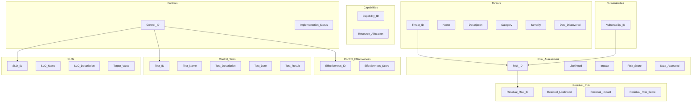

# Enterprise Security Risk Reporting Data Model

## Table of Contents

- [Entities](#entities)
- [Relationships](#relationships)
- [Schema](#schema)

## Entities

### 1. Threats

- **Threat_ID**: A unique identifier for each threat.
- **Name**: The name of the threat.
- **Description**: A detailed description of the threat.
- **Category**: The category or type of threat (e.g., malware, physical attack).
- **Severity**: The severity level of the threat.
- **Date_Discovered**: The date when the threat was discovered.

Sample enterprise security threats: (Source: CISO Lens)
- Insider attack
- Data theft
- External attack
- People
- Physical

Threats could also be considered for specific systems or data but that would be very complex to model and perhaps represents a different use case, i.e. for a threat modeling tool.

### 2. Vulnerabilities

- **Vulnerability_ID**: A unique identifier for each vulnerability.
- **Name**: The name of the vulnerability.
- **Description**: A detailed description of the vulnerability.
- **Severity**: The severity level of the vulnerability.
- **Date_Discovered**: The date when the vulnerability was discovered.
- 

### 3. Risk Assessment

- **Risk_ID**: A unique identifier for each risk assessment.
- **Threat_ID**: A foreign key linking to the associated threat.
- **Vulnerability_ID**: A foreign key linking to the associated vulnerability.
- **Likelihood**: The likelihood of the threat exploiting the vulnerability.
- **Impact**: The potential impact of the threat exploiting the vulnerability.
- **Risk_Score**: A calculated risk score.
- **Date_Assessed**: The date when the risk assessment was conducted.

Sample enterprise risks might include (Source - CISO Lens)
- Operational Disruption, ABC is disrupted or compromised from a security attack resulting in:
    - Harm to staff, the environment or society
    - Damage to physical assets
    - Disruption to Business operations
- Asset(physical and non physical) Protection
    - Unauthorised access or theft of valuable assets (sensitive information, physical sites),resulting in:
        - Fraud
        - Financial loss
        - Privacy breach
- Partners and Supply Chain
    - Third parties relied on by ABC are compromised resulting in:
      - Third Party exploited by adversary to conduct an attack
      - Disruption to operations
- People
  - ABC personnel unintentionally interact with a malicious email resulting in:
        - Credential Theft
        - Disruption to operations

### 4. Capabilities

- **Capability_ID**: A unique identifier for each capability.
- **Name**: The name of the capability.
- **Description**: A description of the capability.
- **Resource_Allocation**: The allocated resources for the capability.

Capabilites could be referred to as key control domains or key control areas, for example:
- Security Risk and Governance
- Information Security and Privacy
- Cyber Awareness
- Appropriate access
- Technology Asset Management
- Perimeter and Endpoint Security
- Vulnerability Management
- Monitoring and Incident Response
- Physical Security
- Third Party Cyber Risk

### 5. Controls

- **Control_ID**: A unique identifier for each control.
- **Name**: The name of the control.
- **Description**: A description of the control.
- **Implementation_Status**: The status of control implementation.
- **Resource_Allocation**: The allocated resources for the control.

### 6. Control Effectiveness

- **Effectiveness_ID**: A unique identifier for each control effectiveness assessment.
- **Control_ID**: A foreign key linking to the associated control.
- **Effectiveness_Score**: The effectiveness score of the control.
- **Date_Assessed**: The date when the control effectiveness was assessed.

### 7. Residual Risk

- **Residual_Risk_ID**: A unique identifier for each residual risk assessment.
- **Risk_ID**: A foreign key linking to the associated risk assessment.
- **Residual_Likelihood**: The remaining likelihood of risk after control implementation.
- **Residual_Impact**: The remaining impact of risk after control implementation.
- **Residual_Risk_Score**: A calculated residual risk score.
- **Date_Assessed**: The date when the residual risk assessment was conducted.

## Relationships

- **Threats and Vulnerabilities**: Threats can be linked to vulnerabilities to assess the risk.
- **Capabilities and Controls**: Capabilities can support specific controls.
- **Controls and Control Effectiveness**: Control effectiveness assessments determine how well controls mitigate risks.
- **Risk Assessment and Residual Risk**: Residual risk is calculated based on the initial risk assessment and control effectiveness.

## Schema

The schema for this data model consists of database tables for each entity with appropriate foreign key relationships to maintain data integrity. The schema should be implemented in a relational database management system (RDBMS) of your choice to store and manage security risk data effectively.

Please refer to the [schema](#schema) section for details on table names and attributes.

Feel free to customize and adapt this data model to meet your organization's specific security risk reporting needs.

